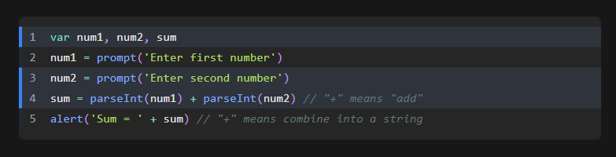

# rehype-prism-plus



[rehype](https://github.com/wooorm/rehype) plugin to highlight code blocks in HTML with [Prism] (via [refractor]) with additional line highlighting and line numbers functionalities.

Inspired by and uses a compatible API as [@mapbox/rehype-prism](https://github.com/mapbox/rehype-prism) with additional support for line-highlighting and line numbers.

Tested to work with [xdm], MDX compiler.

An [appropriate stylesheet](#styling) should be loaded to style the language tokens, format line numbers and highlight lines.

**Best suited for usage in Node.**
If you would like to perform syntax highlighting _in the browser_, you should look into [less heavy ways to use refractor](https://github.com/wooorm/refractor#browser).

## Installation

```
npm install rehype-prism-plus
```

## Usage

Use this package [as a rehype plugin](https://github.com/rehypejs/rehype/blob/master/doc/plugins.md#using-plugins).

Some examples of how you might do that:

```js
import rehype from 'rehype'
import rehypePrism from 'rehype-prism-plus'

rehype().use(rehypePrism).process(/* some html */)
```

Here's an example of syntax highlighting in Markdown, with [xdm]

```js
import { compile } from 'xdm'
import rehypePrism from 'rehype-prism-plus'

async function main(code) {
  console.log(String(await compile(code, { rehypePlugins: [rehypePrism] })))
}

main(`~~~js
console.log(1)
~~~`)
```

## Sample markdown to HTML output

Input:

````md
```js {1,3-4} showLineNumbers
function fancyAlert(arg) {
  if (arg) {
    $.facebox({ div: '#foo' })
  }
}
```
````

HTML Output:

```html
<code class="language-js">
  <div class="code-line line-number highlight-line" line="1">
    <span class="keyword">function</span>
    <span class="function">fancyAlert</span><span class="punctuation">(</span
    ><span class="">arg</span><span class="punctuation">)</span>
    <span class="punctuation">{</span>
  </div>
  <div class="code-line line-number highlight-line" line="2">
    <span class="keyword">if</span>
    <span class="punctuation">(</span>arg<span class="punctuation">)</span>
    <span class="punctuation">{</span>
  </div>
  <div class="code-line line-number" line="3">
    $<span class="punctuation">.</span><span class="function">facebox</span
    ><span class="punctuation">(</span><span class="punctuation">{</span> div<span class="">:</span>
    <span class="string">'#foo'</span>
    <span class="punctuation">}</span><span class="punctuation">)</span>
  </div>
  <div class="code-line line-number" line="4">
    <span class="punctuation">}</span>
  </div>
  <div class="code-line line-number" line="5">
    <span class="punctuation">}</span>
  </div></code
>
```

## Styling

To style the language tokens, you can just copy them from any prismjs compatible ones. Here's a list of [themes](https://github.com/PrismJS/prism-themes).

In addition, the following styles should be added for line highlighting and line numbers to work correctly:

```css
pre {
  overflow-x: auto;
}

/**
 * Inspired by gatsby remark prism - https://www.gatsbyjs.com/plugins/gatsby-remark-prismjs/
 * 1. Make the element just wide enough to fit its content.
 * 2. Always fill the visible space in .code-highlight.
 */
.code-highlight {
  float: left; /* 1 */
  min-width: 100%; /* 2 */
}

.code-line {
  display: block;
  padding-left: 16px;
  padding-right: 16px;
  margin-left: -16px;
  margin-right: -16px;
  border-left-width: 4px;
  border-left-color: rgb(31, 41, 55); /* Set code block color */
}

.highlight-line {
  margin-left: -16px;
  margin-right: -16px;
  background-color: rgba(55, 65, 81, 0.5); /* Set highlight bg color */
  border-left-width: 4px;
  border-left-color: rgb(59, 130, 246); /* Set highlight accent border color */
}

.line-number::before {
  padding-right: 16px;
  margin-left: -8px;
  color: rgb(156, 163, 175); /* Line number color */
  content: attr(line);
}
```

Here's the styled output using the prism-night-owl theme:


For more information on styling of language tokens, consult [refractor] and [Prism].

## API

`rehype().use(rehypePrism, [options])`

Syntax highlights `pre > code`.
Under the hood, it uses [refractor], which is a virtual version of [Prism].

The code language is configured by setting a `language-{name}` class on the `<code>` element.
You can use any [language supported by refractor].

If no `language-{name}` class is found on a `<code>` element, it will be skipped.

### options

#### options.ignoreMissing

Type: `boolean`.
Default: `false`.

By default, if `{name}` does not correspond to a [language supported by refractor] an error will be thrown.

If you would like to silently skip `<code>` elements with invalid languages or support line numbers and line highlighting for code blocks without a specified language, set this option to `true`.

#### options.showLineNumbers

Type: `boolean`.
Default: `false`.

By default, line numbers will only be displayed for code block cells with a meta property that includes 'showLineNumbers'.

If you would like to show line numbers for all code blocks, without specifying the meta property, set this to `true`.

**Note**: This will wrongly assign a language class and the class might appear as `language-{1,3}` or `language-showLineNumbers`, but allow the language highlighting and line number function to work. An possible approach would be to add a placeholder like `unknown` so the `div` will have `class="language-unknown"`

## FAQ

<details>
  <summary>Why does rehype-prism copy the <code>language-</code> class to the <code>&lt;pre&gt;</code> tag?</summary>
  
  [Prism recommends](https://prismjs.com/#basic-usage) adding the `language-` class to the `<code>` tag like this:

```html
<pre><code class="language-css">p { color: red }</code></pre>
```

It bases this recommendation on the HTML5 spec. However, an undocumented behavior of their JavaScript is that, in the process of highlighting the code, they also copy the `language-` class to the `<pre>` tag:

```html
<pre
  class="language-css"
><code class="language-css"><span class="token selector">p</span> <span class="token punctuation">{</span> <span class="token property">color</span><span class="token punctuation">:</span> red <span class="token punctuation">}</span></code></pre>
```

This resulted in many [Prism themes](https://github.com/PrismJS/prism-themes) relying on this behavior by using CSS selectors like `pre[class*="language-"]`. So in order for people using rehype-prism to get the most out of these themes, we decided to do the same.

</details>

[prism]: http://prismjs.com/
[refractor]: https://github.com/wooorm/refractor
[xdm]: https://github.com/wooorm/xdm
[language supported by refractor]: https://github.com/wooorm/refractor#syntaxes
